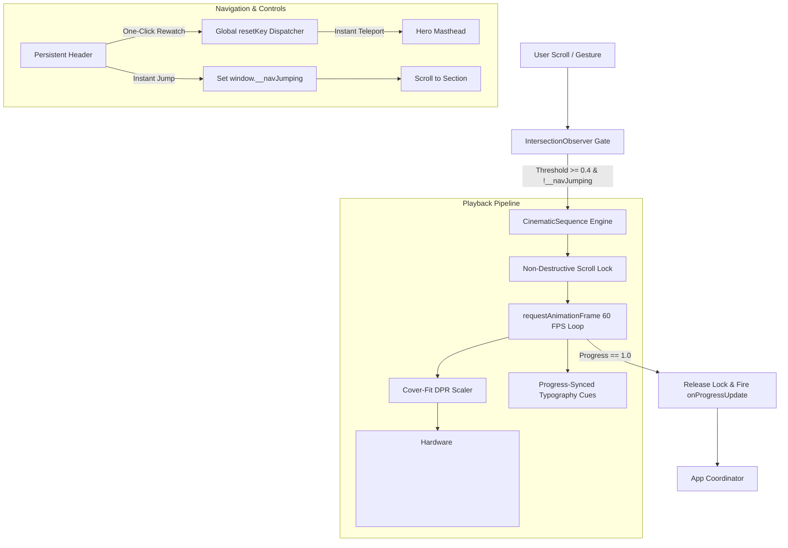

<div align="center">

# CAPTAIN LAKSHMI SAHGAL (1914–2012)
### *An Interactive Digital Monograph & Scroll-Driven Historical Documentary*

[](LICENSE)
[](https://reactjs.org/)
[](https://vitejs.dev/)
[](https://tailwindcss.com/)
[](https://developer.mozilla.org/en-US/docs/Web/API/Canvas_API)
[](https://github.com/jvstin47/Captain-Lakshmi-Invicta/actions)
[](https://nationalarchives.nic.in/)

<p align="center">
  <strong>Physician • Commander of the Rani of Jhansi Regiment • Minister of State • Prisoner of War • Lifelong Healer</strong>
</p>

<p align="center">
  <em>"To heal is to resist; to serve is to remain free."</em>
</p>

---

</div>

## 📖 Executive Overview

**Captain Lakshmi: Invicta** is an editorial-grade, interactive digital monograph commemorating the extraordinary life, anti-colonial leadership, and lifelong medical humanitarianism of **Captain Lakshmi Sahgal (Dr. Lakshmi Swaminathan, 1914–2012)**.

Bridging the rigor of archival scholarship with state-of-the-art web performance, the platform moves beyond traditional static reading by introducing a **hardware-accelerated, scroll-driven cinematic frame sequencer**. Over **3,100+ high-definition frames** across 14 historical acts are decoded and scrubbed in real-time, immersing the reader in visual reconstructions of colonial Madras, wartime Singapore, the dense jungles of the Burma campaign, and five decades of grassroots medical practice in industrial Kanpur.

---

## 🧭 Narrative Continuum: The 14 Historical Acts

The monograph is structured as a 14-act biographical continuum, synchronizing narrative prose, primary source quotations, and verified artifacts:

```
[Act 01: The Awakening] ──▶ [Act 02: Science of Healing] ──▶ [Act 03: The Healer's Oath]
                                                                        │
┌───────────────────────────────────────────────────────────────────────┘
▼
[Act 04: Crossroads in Malaya] ──▶ [Act 05: Clinic of Dispossessed] ──▶ [Act 06: The Commander]
                                                                                │
┌───────────────────────────────────────────────────────────────────────────────┘
▼
[Act 07: The Burma March] ──▶ [Act 08: The Jungle Retreat] ──▶ [Act 09: Trial & Return]
                                                                        │
┌───────────────────────────────────────────────────────────────────────┘
▼
[Act 10: Kanpur: 50 Years Care] ──▶ [Act 11: 1971 Refugee Camps] ──▶ [Act 12: Frontline Activist]
                                                                                │
┌───────────────────────────────────────────────────────────────────────────────┘
▼
[Act 13: The People's Candidate] ──▶ [Act 14: The Living Legacy] ──▶ [Living Will & Body Donation]
```

| Act | Title | Era | Historical Setting | Core Biographical Dimension | Primary Archival Focus |
| :---: | :--- | :---: | :--- | :--- | :--- |
| **01** | **The Awakening** | 1914–1932 | Madras Presidency | Early childhood in an anti-colonial crucible; watching nationalist meetings from her window. | Swaminathan family political memoirs |
| **02** | **The Science of Healing** | 1932–1938 | Madras Medical College | Mastering human anatomy, obstetrics, and surgery amidst colonial scarcity. | MMC Graduation Record (MBBS & DGO) |
| **03** | **The Healer’s Oath** | 1938–1940 | Madras Govt Hospitals | Segregated colonial hospital wards; realizing healthcare is a fundamental human right. | Kasturba Gandhi Hospital clinical logs |
| **04** | **Crossroads in Malaya** | 1940–1941 | Singapore / Malaya | Migrating to Singapore; opening free dispensaries for Tamil rubber plantation coolies. | Serangoon Road diaspora records |
| **05** | **Clinic of the Dispossessed** | 1941–1943 | Wartime Singapore | Operating under Japanese air raids; founding the IIL Medical Wing for prisoners of war. | Wartime civilian relief registers |
| **06** | **The Commander** | 1943–1944 | Singapore / Burma | Answering Netaji's summons; taking command of Asia’s first all-women combat infantry (1,500+ troops). | Rani of Jhansi Regiment Cap Badge |
| **07** | **The Burma March** | 1944–1945 | Maymyo / Imphal | Frontline jungle warfare; operating mobile surgical units under relentless Allied air raids. | Burma Campaign Field Diaries |
| **08** | **The Jungle Retreat** | 1945–1946 | Kalaw / Burma Hills | Refusing personal evacuation; remaining behind in jungle hospital until British capture. | Allied SEAC Interrogation Reports |
| **09** | **Trial & Return** | 1946–1947 | Red Fort, Delhi | Repatriated as a prisoner; the INA trials ignite nationwide rebellion accelerating independence. | Red Fort Military Trial Transcripts |
| **10** | **Kanpur: Fifty Years of Care** | 1947–1970 | Kanpur, UP | Rejecting high office; opening a ₹5 clinic for destitute mill workers and Partition refugees. | Kanpur Clinic Handwritten Register |
| **11** | **1971: The Refugee Camps** | 1971 | Bongaon Border | Organizing emergency cholera triage tents for millions fleeing Bangladesh genocide. | 1971 Border Medical Relief Dispatches |
| **12** | **The Frontline Activist** | 1980s–1990s | Kanpur / Bhopal | Shielding Sikh families during 1984 violence; treating Union Carbide toxic gas survivors in Bhopal. | AIDWA Founding Archives |
| **13** | **The People’s Candidate** | 2002 | New Delhi / National | Historic presidential candidacy at age 87 defending secularism, public welfare, and constitutional rights. | Presidential Campaign Manifesto |
| **14** | **The Living Legacy** | 2012 & Beyond | GSVM Medical College | Treating patients until age 92; final donation of her body and corneas to medical science. | Notarized Living Will & Donation Record |

---

## ⚡ Technical Architecture & Engineering Innovations



### 1. Hardware-Accelerated `<canvas>` Engine (`CinematicSequence.jsx`)
* **Zero-Latency Scrubbing:** Rather than struggling with the keyframe decoding lag and memory overhead of HTML5 `<video>`, individual high-fidelity WebP frames are painted to a hardware-accelerated 2D canvas.
* **Device Pixel Ratio (DPR) Calibration:** Dynamically computes `window.devicePixelRatio` (1x, 2x Retina, 3x mobile) to scale canvas drawing buffers, ensuring crisp lines without blurry interpolation.
* **Aspect-Ratio Cover Geometry:** Centers and scales 16:9 widescreen frames dynamically to fill any display aspect ratio without distortion.
* **Lazy Chunk Decoding:** Frames load progressively in 16-frame batches. Memory allocation is bounded and released, preventing Out-Of-Memory (OOM) crashes on low-spec mobile browsers.

### 2. Intelligent Non-Destructive Scroll Lock
* **Natural Reading Gating:** When a reader reaches an unplayed sequence, the page locks user scroll (`wheel`, `touchmove`, `keydown`) without altering `document.body.style.overflow` (preventing layout shifts and broken smooth-scroll APIs).
* **Guaranteed Auto-Release:** Once the frame loop completes (progress = 100%), event listeners detach immediately, allowing the reader to continue scrolling down to the contextual dispatch.
* **Manual Override Affordances:** Each active sequence provides `[SKIP TO END]` and `[REPLAY SEQUENCE]` buttons for reader autonomy.

### 3. Navigation Teleportation & Jump Protection
* **`window.__navJumping` Coordination:** Rapidly scrolling past 14 viewport-height sequences during a navigation click could cause multiple `IntersectionObserver` callbacks to fire simultaneously. A transient atomic flag blocks en-route observer triggers during programmatic jumps.
* **One-Click Global Rewatch:** Clicking the *Lakshmi Sahgal* monogram in the navigation bar stops active auto-scroll, increments a global `resetKey`, resets all 14 canvas engines to Frame 0, and returns instantly to the top.
* **Live Act Tracker:** The navigation pill dynamically monitors the active chapter, gracefully reverting to `"Historical Monograph"` when the user returns to the hero section.

### 4. Dual Provenance Archival Standard (`ArchivalModal.jsx`)
* **Ethical Separation:** Explicit UI badges separate AI-assisted visual reconstructions from verified archival records.
* **High-Resolution Specimen Viewer:** Fullscreen modal equipped with double-matting borders, year stamps, catalog numbers, source repositories, and historical significance breakdowns.

---

## 🎨 Design System & Aesthetic Tokens

The visual language evokes a 1940s broadsheet newspaper meets a museum archival dossier:

<div align="center">

| Token Name | Hex Code | Usage & Visual Context |
| :--- | :---: | :--- |
| `vintage-deepInk` | `#12100e` | Primary canvas background; warm aged black |
| `vintage-charcoal` | `#262320` | Card surfaces, container borders, modal backdrops |
| `vintage-paper` | `#f3efe6` | Primary typographic headline ink |
| `vintage-sand` | `#dfd5c0` | Body editorial serif text |
| `bronze` | `#c08269` | Primary accent, military highlights, active state |
| `bronze-light` | `#dfab94` | Hover glows, interactive badges |
| `terracotta` | `#913b30` | Gazette dateline stamps, urgent alerts |
| `khaki-dark` | `#303429` | Rani of Jhansi military dossier accents |

</div>

### Typographic Hierarchy

* **Display Masthead & Headings:** `DM Serif Display` — Authoritative, high-contrast serif with classic editorial gravitas.
* **Narrative Prose & Body Text:** `Newsreader` & `Libre Baskerville` — Warm, readable, book-grade literary typography.
* **Archival Metadata & Telegraphic Dispatches:** `Space Mono` & `Courier Prime` — Monospaced typewriter aesthetic representing field dispatches.

### Custom Photo Treatments

* **`.photo-torn` (Hero Carousel):** Archival deckle edge border with warm sepia grading for the historical photo strip.
* **`.photo-stamp` (Archival Modal):** Museum specimen double-matting with bronze beveling and realistic depth shadows.
* **`.photo-darkroom` (Act 06 Badge):** Slight rotational tilt (`-0.8deg`) with bronze halation glow, leveling on hover.

---

## 📂 Repository Structure

```
Captain-Lakshmi-Invicta/
├── .github/
│   ├── workflows/
│   │   ├── ci.yml                  # Automated build & verification pipeline
│   │   └── deploy-pages.yml        # One-click GitHub Pages deployment
│   ├── ISSUE_TEMPLATE/
│   │   ├── bug_report.md           # Bug reproduction & device information
│   │   ├── historical_correction.md# Archival citation & historical verification
│   │   └── feature_request.md      # Feature suggestions
│   └── PULL_REQUEST_TEMPLATE.md    # Verification & testing checklist
├── public/
│   ├── archival_photos/            # Verified historical photographs & documents
│   │   ├── photo_01.jpg            # Capt. Lakshmi in INA Uniform (1943)
│   │   ├── photo_02.jpg            # Rani of Jhansi Inspection with Netaji (1943)
│   │   ├── azad_hind_proclamation.jpg # 1943 Azad Hind Proclamation
│   │   ├── badge_rani_of_jhansi.jpg   # Cast Brass Cap Badge Insignia
│   │   ├── kanpur_clinic_register.jpg # 1962 Free Clinic Register
│   │   └── gsvm_donation_record.jpg   # 2012 Body Donation Certificate
│   ├── favicon.ico                 # Multi-resolution favicon (16/32/64px)
│   ├── favicon.svg                 # Vector 8-pointed regiment star
│   ├── apple-touch-icon.png        # High-res iOS bookmark icon
│   └── sequences/                  # 14 Reconstructed WebP sequences (1600x900)
│       ├── seq-01-origins/         # Act 01: The Awakening (192 frames)
│       ├── seq-02-medicine/        # Act 02: The Science of Healing (192 frames)
│       ├── ...                     # Acts 03 to 13
│       └── seq-14-legacy/          # Act 14: The Living Legacy (240 frames)
├── scripts/
│   └── extract_sequences.py        # FFmpeg frame extraction & scaling pipeline
├── src/
│   ├── components/
│   │   ├── Navigation.jsx          # Sticky header, act tracker & rewatch trigger
│   │   ├── Hero.jsx                # Display masthead & archival photo strip
│   │   ├── DisclaimerBanner.jsx    # Ethical historical reconstruction notice
│   │   ├── CinematicSequence.jsx   # Hardware canvas sequencer & scroll engine
│   │   ├── ChapterBridge.jsx       # Editorial bridge with verified citations
│   │   ├── Chapter06ArchivalHub.jsx# Turning point military archive (Rani of Jhansi)
│   │   ├── HorizontalTimeline.jsx  # Broadsheet newspaper interactive timeline
│   │   ├── LifePortfolioGrid.jsx   # 4-facet biography matrix (Physician/Commander/Healer/Activist)
│   │   ├── FutureChaptersRoadmap.jsx# Acts 07–14 narrative roadmap
│   │   ├── ArchivalModal.jsx       # Primary source museum deep-viewer
│   │   └── Footer.jsx              # Historical bibliography & references
│   ├── data/
│   │   ├── sequencesData.js        # 14 Acts data registry & typography cues
│   │   ├── timelineData.js         # Chronological milestones & gazette dispatches
│   │   ├── portfolioData.js        # Archival exhibits & life facets
│   │   └── heroPhotosData.js       # Archival portraits metadata & provenance
│   ├── App.jsx                     # Top-level application coordinator
│   ├── index.css                   # Custom film grain, letterpress & photo styling
│   └── main.jsx                    # React 19 entrypoint
├── index.html                      # SEO metadata, OpenGraph tags & typography
├── tailwind.config.js              # Archival design tokens & font definitions
├── vite.config.js                  # Vite configuration
├── CONTRIBUTING.md                 # Contribution guidelines
├── CHANGELOG.md                    # Project release notes & milestone history
├── SECURITY.md                     # Security policy & vulnerability reporting
└── LICENSE                         # MIT License with Fair Use disclaimer
```

---

## 🚀 Getting Started

### Prerequisites

* **Node.js:** `v18.0.0` or higher (Node 20+ LTS recommended)
* **npm:** `v9.0.0` or higher
* *(Optional for video asset pipeline)*: **FFmpeg 6.0+** compiled with `libwebp` support

### Local Installation

1. **Clone the Repository:**
   ```bash
   git clone https://github.com/jvstin47/Captain-Lakshmi-Invicta.git
   cd Captain-Lakshmi-Invicta
   ```

2. **Install Dependencies:**
   ```bash
   npm install
   ```

3. **Start the Local Development Server:**
   ```bash
   npm run dev
   ```
   Navigate to `http://localhost:5173/` in your browser.

4. **Verify Production Build:**
   ```bash
   npm run build
   npm run preview
   ```

---

## 🛠️ Video Asset Extraction Pipeline

If you are modifying or regenerating the high-resolution frame sequences from source video clips, use the included Python extraction script:

```bash
# Extract frames, inpaint synthetic watermarks, and compress to high-quality WebP
python3 scripts/extract_sequences.py
```

The underlying FFmpeg command uses Lanczos scaling and `libwebp` compression:
```bash
ffmpeg -i source_clips/act_06.mp4 \
  -vf "fps=30,scale=1600:900:flags=lanczos" \
  -c:v libwebp -quality 82 \
  public/sequences/seq-06-commander/frame_%03d.webp
```

---

## 🌐 Deployment Guide

### Deploying to GitHub Pages
1. Go to repository **Settings > Pages**.
2. Under **Source**, select **GitHub Actions**.
3. Push to `main` — the included `.github/workflows/deploy-pages.yml` workflow will automatically build and publish the site.

### Deploying to Vercel / Netlify
The project is a standard Vite React SPA. Configure your hosting provider with:
* **Build Command:** `npm run build`
* **Output Directory:** `dist`
* **Install Command:** `npm install`

---

## 📚 Primary Historical References & Bibliography

1. **Sahgal, Lakshmi.** *A Revolutionary Life: Memoirs of a Political Activist.* Kali for Women / Zubaan Books, 1997 / 2011. ISBN: 978-8186706404.
2. **National Archives of India (NAI), New Delhi:** *Indian Independence League (IIL) and Indian National Army (INA) Papers, 1942–1946.*
3. **Bose, Subhas Chandra.** *Collected Works of Netaji Subhas Chandra Bose (Vol. 11: Special INA Edition).* Netaji Research Bureau, Kolkata.
4. **Hills, Carol and Silverman, Daniel C.** *Nationalism and Feminism in Late Colonial India: The Rani of Jhansi Regiment.* Modern Asian Studies, Vol. 27, No. 4 (1993), pp. 741–760.
5. **Imperial War Museum, London:** *Allied SEAC Dispatches & Indian National Army Interrogation Reports (1945–1946).*
6. **GSVM Medical College & Kanpur Municipal Archives:** *Records of Free Medical Practice and Public Dispensaries (1952–2012).*

---

## 📄 License & Fair Use Notice

This software is distributed under the [MIT License](LICENSE).

**Archival & Fair Use Statement:**
Historical citations, primary documents, photographs, and public domain references included in this project are curated exclusively for non-commercial educational, commemorative, and historical preservation purposes under Fair Use guidelines. Original photographic rights remain with their respective archival repositories (National Archives of India, Netaji Research Bureau, and Imperial War Museum).

---

<div align="center">

**Dedicated to the memory of Captain Lakshmi Sahgal (1914–2012)**  
*Soldier of Freedom • Physician to the People*

</div>


